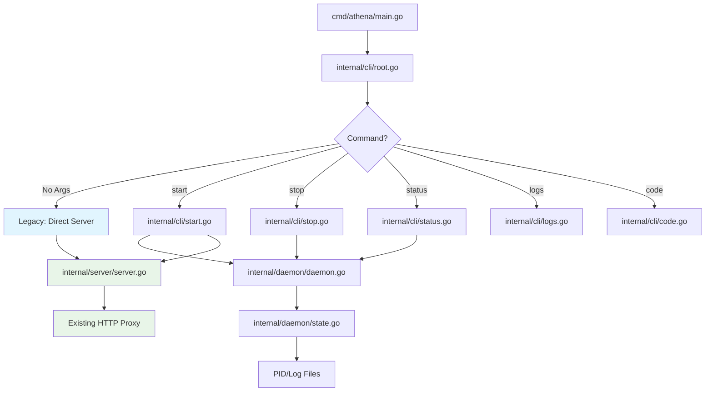
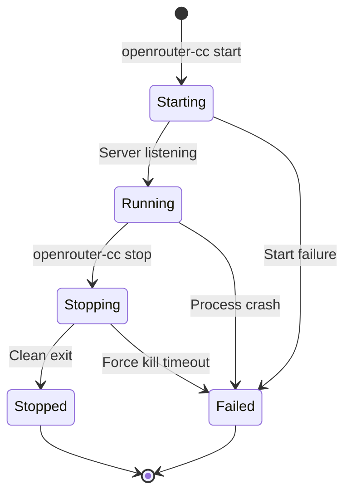

# CLI Subcommands Technical Design

## Overview

This document outlines the technical design for adding CLI subcommands to openrouter-cc, enabling daemon-style process management while maintaining full backward compatibility with the existing direct execution model.

## Architecture

### Current Architecture

```
┌─────────────┐
│   main()    │
├─────────────┤
│ loadConfig  │
│ createServer│
│ startServer │
└─────────────┘
```

**Current Flow:**
1. Parse CLI flags directly in main()
2. Load configuration from multiple sources
3. Create HTTP server with proxy handlers
4. Start server and block until interrupted

### Proposed Architecture

```
┌─────────────────────────────────────────────────────┐
│           cmd/athena/main.go (~20 lines)            │
│              cli.Execute() entry point              │
└─────────────────────────────────────────────────────┘
                          │
                          ▼
┌─────────────────────────────────────────────────────┐
│                 internal/cli/                       │
│              Cobra Command Layer                    │
├─────────────────────────────────────────────────────┤
│  root.go    │ Cobra root command + persistent flags │
│  start.go   │ Start daemon command                  │
│  stop.go    │ Stop daemon command                   │
│  status.go  │ Status display command                │
│  logs.go    │ Log streaming command                 │
│  code.go    │ Claude Code integration command       │
└─────────────────────────────────────────────────────┘
                          │
                          ▼
┌─────────────────────────────────────────────────────┐
│               internal/daemon/                      │
│           Daemon Management Layer                   │
├─────────────────────────────────────────────────────┤
│  daemon.go  │ Process lifecycle management          │
│             │ - StartDaemon()                       │
│             │ - StopDaemon()                        │
│             │ - GetStatus()                         │
│             │                                       │
│  state.go   │ PID file and state management         │
│             │ - SaveState()                         │
│             │ - LoadState()                         │
│             │ - CleanupFiles()                      │
└─────────────────────────────────────────────────────┘
                          │
                          ▼
┌─────────────────────────────────────────────────────┐
│    Existing Packages (unchanged)                    │
├─────────────────────────────────────────────────────┤
│  internal/config/   │ Configuration loading         │
│  internal/server/   │ HTTP server creation          │
│  internal/transform/│ Message transformation        │
│  internal/util/     │ Foundation utilities          │
└─────────────────────────────────────────────────────┘
```

**Proposed Flow:**
1. **CLI Entry**: cmd/athena/main.go calls cli.Execute() to start Cobra
2. **Command Routing**: internal/cli/ routes to appropriate command handler
3. **Daemon Management**: internal/daemon/ handles process lifecycle and state
4. **Server Integration**: Reuse existing internal/config and internal/server packages
5. **Backward Compatibility**: root.go default behavior preserves legacy mode

### Component Integration



## Technical Implementation

### Daemon Package Structure

#### internal/daemon/state.go

**Purpose**: PID file and state management with cross-platform compatibility.

```go
package daemon

import (
    "encoding/json"
    "os"
    "path/filepath"
    "time"
)

// ProcessState represents daemon process state stored in PID file
type ProcessState struct {
    PID        int       `json:"pid"`
    Port       int       `json:"port"`
    StartTime  time.Time `json:"start_time"`
    ConfigPath string    `json:"config_path"`
}

// SaveState writes process state to PID file atomically
func SaveState(state *ProcessState) error {
    // 1. Ensure data directory exists (~/.openrouter-cc/)
    // 2. Create temporary file with exclusive lock
    // 3. Write JSON with proper permissions (0600)
    // 4. Atomic rename to PID file location
}

// LoadState reads and validates process state from PID file
func LoadState() (*ProcessState, error) {
    // 1. Read PID file with file locking
    // 2. Parse JSON and validate structure
    // 3. Verify process still exists (IsProcessRunning)
    // 4. Return validated state or error
}

// CleanupState removes PID file and cleans up state
func CleanupState() error {
    // 1. Remove PID file atomically
    // 2. Rotate old log files if needed
    // 3. Clean temporary files
}

// ValidateState performs business rule validation
func (s *ProcessState) Validate() error {
    // - PID > 0 and process exists
    // - Port in valid range (1024-65535)
    // - StartTime not in future
    // - ConfigPath exists and readable
}
```

**File Management Strategy:**
- **Atomic Operations**: Use temporary files + atomic rename
- **Locking**: Leverage internal/util/ LockFile() and UnlockFile()
- **Permissions**: 0600 for PID files (owner read/write only)
- **Location**: Uses internal/util/ GetDataDir(), GetPidFilePath(), GetLogFilePath()

#### internal/daemon/daemon.go

**Purpose**: Cross-platform daemon process lifecycle management.

```go
package daemon

import (
    "fmt"
    "os"
    "os/exec"
    "time"

    "github.com/martinrichards/openrouter-cc/internal/config"
    "github.com/martinrichards/openrouter-cc/internal/util"
)

// StartDaemon starts the proxy server as a background daemon
func StartDaemon(cfg *config.Config) error {
    // 1. Check if daemon already running (LoadState + IsProcessRunning)
    // 2. Fork new process with os/exec
    // 3. Configure process group and I/O redirection
    // 4. Start process and save state
    // 5. Return immediately (non-blocking)
}

// StopDaemon gracefully stops the running daemon
func StopDaemon(timeout time.Duration) error {
    // 1. Load state from PID file
    // 2. Send graceful shutdown signal (SIGTERM/os.Interrupt)
    // 3. Wait for clean exit up to timeout
    // 4. Force kill if timeout exceeded
    // 5. Cleanup state files
}

// GetStatus returns current daemon status
func GetStatus() (*Status, error) {
    // 1. Load state from PID file
    // 2. Check if process running
    // 3. Calculate uptime
    // 4. Read memory usage from proc/task manager
    // 5. Return Status struct
}

// Status represents daemon status information
type Status struct {
    Running    bool
    PID        int
    Port       int
    Uptime     time.Duration
    Memory     uint64
    ConfigPath string
}
```

**Platform-Specific Considerations:**

| Aspect | Unix/Linux | Windows |
|--------|------------|---------|
| Process Creation | `os/exec` with `Setpgid` | `CREATE_NEW_PROCESS_GROUP` |
| Signal Handling | SIGTERM → SIGKILL | os.Interrupt → TerminateProcess |
| Process Detection | `util.IsProcessRunning()` | `util.IsProcessRunning()` |
| I/O Redirection | Redirect to log files | Redirect to log files |

**File Structure:**
```
~/.openrouter-cc/
├── openrouter-cc.pid      # Process state (JSON)
├── openrouter-cc.log      # Current log file
├── openrouter-cc.log.1    # Previous log file
├── openrouter-cc.log.2    # Older log file
└── tmp/                   # Temporary files for atomic operations
```

## Data Management

### Persistence Strategy

**File-Based State Management:**
- **Location**: `~/.openrouter-cc/` directory
- **Format**: JSON for structured data, plain text for logs
- **Atomicity**: Temporary file + atomic rename pattern
- **Locking**: Exclusive file locks prevent corruption

**PID File Format:**
```json
{
  "pid": 12345,
  "port": 11434,
  "start_time": "2024-01-15T10:30:00Z",
  "config_path": "/home/user/.config/openrouter-cc/openrouter.yml"
}
```

### State Management Approach

**Process Lifecycle States:**
1. **Starting**: Process launching but not yet listening
2. **Running**: Process active and handling requests
3. **Stopping**: Graceful shutdown initiated
4. **Stopped**: Process cleanly exited
5. **Failed**: Process crashed or failed to start

**State Transitions:**


### Cross-Platform File Handling

**Unix/Linux:**
```go
// File permissions
const PID_FILE_MODE = 0600  // Owner read/write only
const LOG_FILE_MODE = 0644  // Owner read/write, group/other read
const DIR_MODE = 0755       // Standard directory permissions

// File locking
func lockFile(file *os.File) error {
    return syscall.Flock(int(file.Fd()), syscall.LOCK_EX|syscall.LOCK_NB)
}
```

**Windows:**
```go
// File sharing restrictions
func createExclusiveFile(path string) (*os.File, error) {
    return os.OpenFile(path, os.O_CREATE|os.O_WRONLY|os.O_EXCL, 0600)
}

// Process creation with job objects
func startDaemonWindows(config *Config) error {
    // Use job objects for proper process grouping
    // Handle Windows service integration if needed
}
```

## CLI Interface Design

### Command Structure

```
openrouter-cc [global-flags] <command> [command-flags]

Commands:
  start    Start daemon process
  stop     Stop daemon process  
  status   Show daemon status
  logs     Show/follow daemon logs
  code     Start daemon and launch Claude Code
  
Legacy Mode (backward compatible):
  openrouter-cc [flags]  # Direct execution without subcommands
```

### Command Implementation

#### Start Command (internal/cli/start.go)

```bash
openrouter-cc start [--port 11434] [--config openrouter.yml]

Options:
  --port     Port to bind (default: 11434, from persistent flags)
  --config   Configuration file path (from persistent flags)
```

**Implementation:**
```go
package cli

import (
    "fmt"
    "github.com/spf13/cobra"
    "github.com/martinrichards/openrouter-cc/internal/config"
    "github.com/martinrichards/openrouter-cc/internal/daemon"
)

var startCmd = &cobra.Command{
    Use:   "start",
    Short: "Start OpenRouter CC daemon",
    RunE: func(cmd *cobra.Command, args []string) error {
        // 1. Load configuration
        cfg := config.Load(configFile)
        applyFlagOverrides(cfg)

        // 2. Start daemon
        err := daemon.StartDaemon(cfg)
        if err != nil {
            return fmt.Errorf("failed to start daemon: %w", err)
        }

        // 3. Display status
        fmt.Printf("✓ Daemon started on port %s\n", cfg.Port)
        return nil
    },
}
```

#### Stop Command (internal/cli/stop.go)

```bash
openrouter-cc stop [--timeout 30s]

Options:
  --timeout  Graceful shutdown timeout (default: 30s)
```

**Implementation:**
```go
package cli

import (
    "fmt"
    "time"
    "github.com/spf13/cobra"
    "github.com/martinrichards/openrouter-cc/internal/daemon"
)

var stopCmd = &cobra.Command{
    Use:   "stop",
    Short: "Stop OpenRouter CC daemon",
    RunE: func(cmd *cobra.Command, args []string) error {
        timeout, _ := cmd.Flags().GetDuration("timeout")

        err := daemon.StopDaemon(timeout)
        if err != nil {
            return fmt.Errorf("failed to stop daemon: %w", err)
        }

        fmt.Println("✓ Daemon stopped")
        return nil
    },
}

func init() {
    stopCmd.Flags().Duration("timeout", 30*time.Second, "Graceful shutdown timeout")
}
```

#### Status Command (internal/cli/status.go)

```bash
openrouter-cc status [--json]

Options:
  --json     Output status as JSON
```

**Implementation:**
```go
package cli

import (
    "encoding/json"
    "fmt"
    "github.com/spf13/cobra"
    "github.com/martinrichards/openrouter-cc/internal/daemon"
)

var statusCmd = &cobra.Command{
    Use:   "status",
    Short: "Show OpenRouter CC daemon status",
    RunE: func(cmd *cobra.Command, args []string) error {
        status, err := daemon.GetStatus()
        if err != nil {
            return fmt.Errorf("failed to get status: %w", err)
        }

        asJSON, _ := cmd.Flags().GetBool("json")
        if asJSON {
            json.NewEncoder(os.Stdout).Encode(status)
        } else {
            printHumanStatus(status)
        }
        return nil
    },
}

func init() {
    statusCmd.Flags().Bool("json", false, "Output as JSON")
}
```

**Output Format:**
```
OpenRouter CC Status
====================
Status: Running
PID: 12345
Port: 11434
Uptime: 2h 15m 30s
Config: /home/user/.config/openrouter-cc/openrouter.yml
Memory: 45.2 MB
```

### Backward Compatibility (internal/cli/root.go)

**Root Command with Legacy Mode:**
```go
package cli

import (
    "github.com/spf13/cobra"
    "github.com/martinrichards/openrouter-cc/internal/config"
    "github.com/martinrichards/openrouter-cc/internal/server"
)

var (
    configFile string
    port       string
    apiKey     string
)

var rootCmd = &cobra.Command{
    Use:   "openrouter-cc",
    Short: "OpenRouter CC - Anthropic to OpenRouter proxy",
    // Default behavior: Start server in foreground (legacy mode)
    RunE: func(cmd *cobra.Command, args []string) error {
        // Load configuration
        cfg := config.Load(configFile)
        applyFlagOverrides(cfg)

        // Start server directly (blocking, legacy mode)
        srv := server.New(cfg)
        return srv.Start()
    },
}

func init() {
    // Persistent flags available to all commands
    rootCmd.PersistentFlags().StringVar(&configFile, "config", "", "Config file path")
    rootCmd.PersistentFlags().StringVar(&port, "port", "", "Port to bind")
    rootCmd.PersistentFlags().StringVar(&apiKey, "api-key", "", "OpenRouter API key")

    // Add subcommands
    rootCmd.AddCommand(startCmd, stopCmd, statusCmd, logsCmd, codeCmd)
}

func Execute() error {
    return rootCmd.Execute()
}
```

**Legacy Mode Behavior:**
- Running `openrouter-cc` with no subcommand starts server in foreground
- All existing flags (`--port`, `--config`, `--api-key`) work identically
- Direct server startup with blocking execution (no daemon)
- Identical output and error handling

### User Interaction Patterns

**Interactive Confirmations:**
```bash
$ openrouter-cc stop
Found running daemon (PID: 12345) on port 11434
Stop daemon? [y/N]: y
Stopping daemon... done
```

**Progress Indicators:**
```bash
$ openrouter-cc start
Starting OpenRouter CC daemon...
✓ Configuration loaded
✓ Port 11434 available  
✓ Daemon started (PID: 12345)
✓ Server listening on http://localhost:11434

Daemon is ready for connections.
```

**Error Handling:**
```bash
$ openrouter-cc start
Starting OpenRouter CC daemon...
✗ Error: Port 11434 already in use by PID 9876
  
Try: openrouter-cc status    # Check current daemon
     openrouter-cc stop      # Stop existing daemon
```

## Security & Performance

### File Permissions and Locking

**Security Model:**
- **PID Files**: 0600 permissions (owner read/write only)
- **Log Files**: 0644 permissions (owner read/write, others read)
- **Data Directory**: 0755 permissions with sticky bit on Unix
- **Config Files**: Respect existing permissions, warn if too permissive

**Locking Strategy:**
```go
type SafeFileWriter struct {
    path     string
    tempPath string
    file     *os.File
    locked   bool
}

func (w *SafeFileWriter) Write(data []byte) error {
    // 1. Create temporary file with restricted permissions
    // 2. Acquire exclusive lock on target file
    // 3. Write data to temporary file
    // 4. Atomic rename to target path
    // 5. Release lock
}
```

**Race Condition Prevention:**
- All state modifications use exclusive file locking
- Process existence checks are atomic
- Multiple start attempts are properly serialized

### Process Isolation

**Daemon Process Characteristics:**
- **Process Group**: New process group to prevent signal propagation
- **Standard I/O**: Redirect to log files, not terminal
- **Working Directory**: Change to data directory for core dumps
- **Environment**: Clean environment with minimal variables
- **Resource Limits**: Set appropriate limits for memory and file descriptors

**Security Boundaries:**
```go
func configureDaemonProcess(cmd *exec.Cmd) {
    // Unix: Create new process group
    cmd.SysProcAttr = &syscall.SysProcAttr{
        Setpgid: true,
        Pgid:    0,
    }
    
    // Redirect I/O to log files
    cmd.Stdout = logFile
    cmd.Stderr = logFile
    cmd.Stdin = nil
    
    // Clean environment
    cmd.Env = []string{
        "HOME=" + homeDir,
        "PATH=" + essentialPath,
    }
}
```

### Resource Management

**Memory Management:**
- Process state kept minimal (< 1KB per daemon)
- Log rotation prevents unbounded disk usage
- Temporary files cleaned up aggressively

**Performance Targets:**
- **Command Response Time**: < 100ms for status/stop commands
- **Daemon Startup Time**: < 2 seconds from command to listening
- **Memory Overhead**: < 500KB additional for daemon management
- **File I/O**: All operations use buffered I/O and atomic writes

**Resource Limits:**
```go
// Set appropriate limits for daemon process
func setResourceLimits() error {
    // Maximum memory: 1GB
    setLimit(syscall.RLIMIT_AS, 1024*1024*1024)
    
    // Maximum file descriptors: 1024
    setLimit(syscall.RLIMIT_NOFILE, 1024)
    
    // CPU time limit: unlimited (proxy workload)
    setLimit(syscall.RLIMIT_CPU, syscall.RLIM_INFINITY)
}
```

## Implementation Phases

See `docs/specs/subcommands/implementation-plan-v2.md` for detailed tasks and acceptance criteria.

### Phase 1: Module Structure & Cobra Integration (6 hours)

**Deliverable:** New packages created, Cobra integrated, backward compatibility preserved

**Key Tasks:**
- Create `internal/cli/` package with root.go
- Create `internal/daemon/` package structure
- Add Cobra dependency: `go get github.com/spf13/cobra@latest`
- Implement root command with persistent flags
- Update `cmd/athena/main.go` to call `cli.Execute()`
- Ensure backward compatibility: `athena -port 9000` works unchanged

**Testing:**
- Unit tests for root command flag parsing
- Integration test: existing usage patterns work unchanged

### Phase 2: Daemon Package & Start Command (8 hours)

**Deliverable:** Daemon process management with start command functional

**Key Tasks:**
- Implement `internal/daemon/state.go` with ProcessState struct
- Implement `internal/daemon/daemon.go` with StartDaemon()
- Implement `internal/cli/start.go` command
- Cross-platform process detachment and daemonization
- PID file save/load with validation

**Testing:**
- Unit tests for state persistence
- Integration test: start command creates daemon
- Test: multiple start attempts handled correctly

### Phase 3: Stop & Status Commands (5 hours)

**Deliverable:** Process control and monitoring complete

**Key Tasks:**
- Implement `internal/cli/stop.go` with graceful shutdown
- Implement `internal/cli/status.go` with status display
- Add graceful shutdown to server package (SIGTERM/SIGINT handling)
- PID file cleanup and state management

**Testing:**
- Unit tests for stop command logic
- Unit tests for status output formatting
- Integration test: full start → status → stop workflow

### Phase 4: Logs Command (4 hours)

**Deliverable:** Log management and streaming

**Key Tasks:**
- Add file logging to daemon mode in internal/daemon/
- Implement log rotation (10MB, keep 3 files)
- Implement `internal/cli/logs.go` with streaming

**Testing:**
- Unit tests for log rotation logic
- Integration test: logs command displays output
- Test: follow mode streams new entries

### Phase 5: Code Command & Polish (4 hours)

**Deliverable:** Claude Code integration and final testing

**Key Tasks:**
- Implement `internal/cli/code.go` with environment setup
- Error handling polish across all commands
- Documentation updates (README, help text)

**Testing:**
- Unit tests for environment setup
- Integration test: code command launches successfully
- Full end-to-end workflow test

### Phase 6: Cross-Platform Testing & CI (3 hours)

**Deliverable:** Verified cross-platform compatibility

**Key Tasks:**
- Test on Linux, macOS, Windows
- Update CI/CD for Cobra dependency
- Performance validation
- Binary size check

**Testing:**
- CI runs on all platforms
- Performance benchmarks pass
- Backward compatibility tests pass

## Success Metrics

**Functionality:**
- [ ] All existing CLI flags work exactly as before
- [ ] All new subcommands work across platforms
- [ ] Daemon processes start and stop cleanly
- [ ] State persistence survives system reboots

**Performance:**
- [ ] Command response time < 100ms (95th percentile)
- [ ] Daemon startup time < 2 seconds
- [ ] Memory overhead < 500KB
- [ ] No performance regression in proxy functionality

**Reliability:**
- [ ] Zero data loss during daemon lifecycle operations
- [ ] Graceful handling of edge cases (permission errors, disk full, etc.)
- [ ] Proper cleanup of resources on exit
- [ ] Stable operation across system restarts

**Usability:**
- [ ] Intuitive command structure matching user expectations  
- [ ] Clear error messages with actionable guidance
- [ ] Consistent output formatting across commands
- [ ] Seamless transition from legacy to daemon mode

This design provides a comprehensive roadmap for implementing CLI subcommands using proper Go package structure (internal/cli/ and internal/daemon/) with Cobra framework integration, while ensuring full backward compatibility with existing usage patterns.