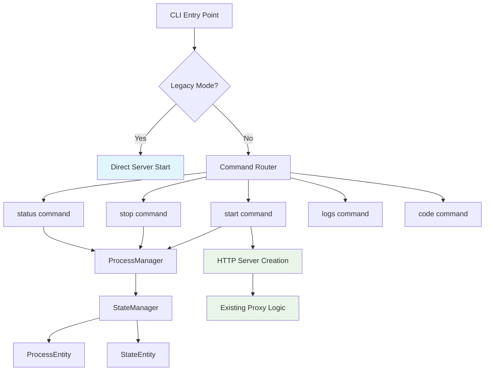
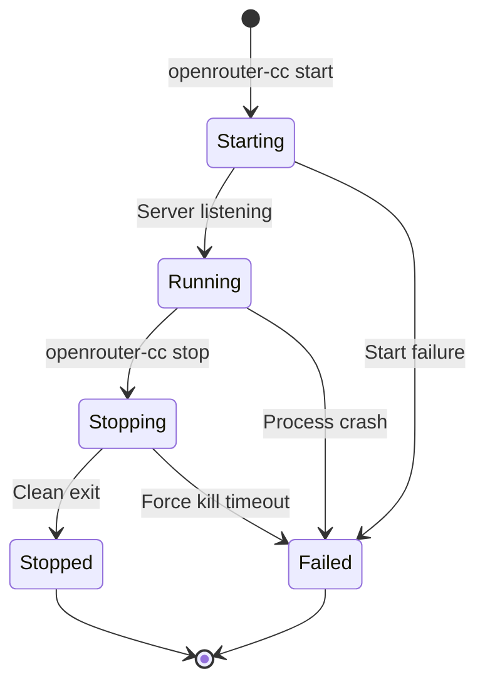

# CLI Subcommands Technical Design

## Overview

This document outlines the technical design for adding CLI subcommands to openrouter-cc, enabling daemon-style process management while maintaining full backward compatibility with the existing direct execution model.

## Architecture

### Current Architecture

```
┌─────────────┐
│   main()    │
├─────────────┤
│ loadConfig  │
│ createServer│
│ startServer │
└─────────────┘
```

**Current Flow:**
1. Parse CLI flags directly in main()
2. Load configuration from multiple sources
3. Create HTTP server with proxy handlers
4. Start server and block until interrupted

### Proposed Architecture

```
┌─────────────────────────────────────────────────────┐
│                    main()                           │
│                Command Dispatcher                    │
├─────────────────────────────────────────────────────┤
│ ┌─────────────┐ ┌─────────────┐ ┌─────────────────┐ │
│ │ CLI Router  │ │ Legacy Mode │ │ Daemon Commands │ │
│ │ (cobra)     │ │ Detection   │ │   Manager       │ │
│ └─────────────┘ └─────────────┘ └─────────────────┘ │
├─────────────────────────────────────────────────────┤
│                Service Layer                        │
├─────────────────────────────────────────────────────┤
│ ┌───────────────┐ ┌─────────────┐ ┌─────────────────┐ │
│ │ProcessManager │ │StateManager │ │ CommandRouter   │ │
│ │- StartDaemon  │ │- SaveState  │ │- route()        │ │
│ │- StopDaemon   │ │- LoadState  │ │- execute()      │ │
│ │- GetStatus    │ │- CleanupFiles│ │- validate()     │ │
│ └───────────────┘ └─────────────┘ └─────────────────┘ │
├─────────────────────────────────────────────────────┤
│                Domain Entities                      │
├─────────────────────────────────────────────────────┤
│ ┌─────────────────┐ ┌─────────────────────────────────┐ │
│ │ ProcessEntity   │ │        StateEntity              │ │
│ │- pid            │ │- pidFilePath                    │ │
│ │- port           │ │- logFilePath                    │ │
│ │- startTime      │ │- dataDir                        │ │
│ │- configPath     │ │- ensureDataDir()                │ │
│ │- isAlive()      │ │- lockPidFile()                  │ │
│ │- toPidFile()    │ │- rotateLogs()                   │ │
│ └─────────────────┘ └─────────────────────────────────┘ │
├─────────────────────────────────────────────────────┤
│              Existing HTTP Server                   │
│            (unchanged architecture)                 │
└─────────────────────────────────────────────────────┘
```

**Proposed Flow:**
1. **Command Detection**: Determine if running in legacy mode or with subcommands
2. **Routing**: Dispatch to appropriate command handler via cobra framework
3. **Service Layer**: Handle process lifecycle, state management, and command execution
4. **Domain Layer**: Manage entities and business logic
5. **Integration**: Reuse existing HTTP server creation and configuration loading

### Component Integration



## Technical Implementation

### Domain Entities

#### ProcessEntity

**Purpose**: Represents a running daemon process with complete lifecycle management.

```go
type ProcessEntity struct {
    PID        int       `json:"pid"`
    Port       int       `json:"port"`
    StartTime  time.Time `json:"start_time"`
    ConfigPath string    `json:"config_path"`
}

// Core business methods
func (p *ProcessEntity) IsAlive() bool {
    // Platform-specific process existence check
    // Unix: kill(pid, 0) == nil
    // Windows: OpenProcess() success
}

func (p *ProcessEntity) FromPidFile(path string) error {
    // Atomic read with file locking
    // JSON deserialization with validation
}

func (p *ProcessEntity) ToPidFile(path string) error {
    // Atomic write with exclusive locking
    // JSON serialization with proper permissions
}

func (p *ProcessEntity) Validate() error {
    // Business rule validation:
    // - PID > 0 and process exists
    // - Port in valid range (1024-65535)
    // - StartTime not in future
    // - ConfigPath exists and readable
}
```

**Validation Rules:**
- PID must be positive and correspond to running process
- Port must be valid and not already bound by different process
- Start time must be reasonable (not future, not ancient)
- Config path must exist and be readable

#### StateEntity

**Purpose**: Manages persistent state files and data directory structure.

```go
type StateEntity struct {
    PidFilePath string `json:"pid_file_path"`
    LogFilePath string `json:"log_file_path"`
    DataDir     string `json:"data_dir"`
}

func (s *StateEntity) EnsureDataDir() error {
    // Create ~/.openrouter-cc/ with proper permissions
    // Platform-specific: 0755 on Unix, appropriate ACLs on Windows
}

func (s *StateEntity) LockPidFile() error {
    // Acquire exclusive lock for atomic operations
    // Unix: flock(LOCK_EX | LOCK_NB)
    // Windows: File attributes with sharing restrictions
}

func (s *StateEntity) RotateLogs() error {
    // Rotate when log exceeds 10MB
    // Keep 3 historical files: .log, .log.1, .log.2
    // Atomic rotation to prevent data loss
}
```

**File Management Strategy:**
- **Atomic Operations**: All state changes use temporary files + atomic rename
- **Locking**: Exclusive locks prevent concurrent access
- **Permissions**: Restrictive permissions for security (600 for sensitive files)

### Service Layer Design

#### ProcessManager

**Purpose**: Cross-platform daemon process lifecycle management.

```go
type ProcessManager struct {
    stateManager *StateManager
    config       *Config
}

func (pm *ProcessManager) StartDaemon(config *Config) error {
    // 1. Validate no existing daemon on port
    // 2. Create detached process with proper signal handling
    // 3. Save process state to PID file
    // 4. Return immediately (non-blocking)
}

func (pm *ProcessManager) StopDaemon() error {
    // 1. Read PID from state file
    // 2. Send graceful shutdown signal (SIGTERM/os.Interrupt)
    // 3. Wait up to 30 seconds for clean exit
    // 4. Force termination if necessary (SIGKILL)
    // 5. Clean up state files
}

func (pm *ProcessManager) GetStatus() ProcessStatus {
    // Return comprehensive status:
    // - Running/Stopped state
    // - Process details (PID, uptime, memory usage)
    // - Configuration summary
    // - Health check results
}
```

**Platform-Specific Considerations:**

| Aspect | Unix/Linux | Windows |
|--------|------------|---------|
| Process Creation | `os/exec` with `Setpgid` | `CREATE_NEW_PROCESS_GROUP` |
| Signal Handling | SIGTERM → SIGKILL | os.Interrupt → TerminateProcess |
| File Locking | `flock` syscall | File attributes with sharing mode |
| Process Detection | `/proc` or `kill(pid, 0)` | `OpenProcess` + `GetExitCodeProcess` |

#### StateManager

**Purpose**: File-based persistence with cross-platform compatibility.

```go
type StateManager struct {
    dataDir string
}

func (sm *StateManager) SaveProcessState(process *ProcessEntity) error {
    // 1. Ensure data directory exists
    // 2. Acquire exclusive lock on PID file
    // 3. Write process data atomically
    // 4. Set appropriate file permissions
    // 5. Release lock
}

func (sm *StateManager) LoadProcessState() (*ProcessEntity, error) {
    // 1. Read PID file with validation
    // 2. Verify process still exists
    // 3. Return validated entity or error
}

func (sm *StateManager) CleanupFiles() error {
    // 1. Remove stale PID files
    // 2. Rotate old log files
    // 3. Clean temporary files
}
```

**File Structure:**
```
~/.openrouter-cc/
├── openrouter-cc.pid      # Process state (JSON)
├── openrouter-cc.log      # Current log file
├── openrouter-cc.log.1    # Previous log file
├── openrouter-cc.log.2    # Older log file
└── tmp/                   # Temporary files for atomic operations
```

## Data Management

### Persistence Strategy

**File-Based State Management:**
- **Location**: `~/.openrouter-cc/` directory
- **Format**: JSON for structured data, plain text for logs
- **Atomicity**: Temporary file + atomic rename pattern
- **Locking**: Exclusive file locks prevent corruption

**PID File Format:**
```json
{
  "pid": 12345,
  "port": 11434,
  "start_time": "2024-01-15T10:30:00Z",
  "config_path": "/home/user/.config/openrouter-cc/openrouter.yml"
}
```

### State Management Approach

**Process Lifecycle States:**
1. **Starting**: Process launching but not yet listening
2. **Running**: Process active and handling requests
3. **Stopping**: Graceful shutdown initiated
4. **Stopped**: Process cleanly exited
5. **Failed**: Process crashed or failed to start

**State Transitions:**


### Cross-Platform File Handling

**Unix/Linux:**
```go
// File permissions
const PID_FILE_MODE = 0600  // Owner read/write only
const LOG_FILE_MODE = 0644  // Owner read/write, group/other read
const DIR_MODE = 0755       // Standard directory permissions

// File locking
func lockFile(file *os.File) error {
    return syscall.Flock(int(file.Fd()), syscall.LOCK_EX|syscall.LOCK_NB)
}
```

**Windows:**
```go
// File sharing restrictions
func createExclusiveFile(path string) (*os.File, error) {
    return os.OpenFile(path, os.O_CREATE|os.O_WRONLY|os.O_EXCL, 0600)
}

// Process creation with job objects
func startDaemonWindows(config *Config) error {
    // Use job objects for proper process grouping
    // Handle Windows service integration if needed
}
```

## CLI Interface Design

### Command Structure

```
openrouter-cc [global-flags] <command> [command-flags]

Commands:
  start    Start daemon process
  stop     Stop daemon process  
  status   Show daemon status
  logs     Show/follow daemon logs
  code     Start daemon and launch Claude Code
  
Legacy Mode (backward compatible):
  openrouter-cc [flags]  # Direct execution without subcommands
```

### Command Implementation

#### Start Command
```bash
openrouter-cc start [--port 11434] [--config openrouter.yml] [--daemon]

Options:
  --port     Port to bind (default: 11434)
  --config   Configuration file path
  --daemon   Run as daemon (default: true)
```

**Implementation Logic:**
1. Check for existing daemon on port
2. Validate configuration
3. Start daemon process in background  
4. Save process state
5. Verify daemon started successfully
6. Display status and connection info

#### Stop Command
```bash
openrouter-cc stop [--timeout 30s] [--force]

Options:
  --timeout  Graceful shutdown timeout (default: 30s)
  --force    Force kill if graceful shutdown fails
```

**Implementation Logic:**
1. Read PID from state file
2. Send graceful shutdown signal
3. Wait for process to exit
4. Clean up state files
5. Confirm daemon stopped

#### Status Command
```bash
openrouter-cc status [--json] [--verbose]

Options:
  --json     Output status as JSON
  --verbose  Show detailed information
```

**Output Format:**
```
OpenRouter CC Status
====================
Status: Running
PID: 12345
Port: 11434
Uptime: 2h 15m 30s
Config: /home/user/.config/openrouter-cc/openrouter.yml
Memory: 45.2 MB
Requests: 1,247 total, 12/min avg
```

### Backward Compatibility Preservation

**Detection Logic:**
```go
func isLegacyMode(args []string) bool {
    // No subcommands provided
    if len(args) == 0 {
        return true
    }
    
    // First argument is a flag (starts with -)
    if strings.HasPrefix(args[0], "-") {
        return true
    }
    
    // First argument is not a known command
    knownCommands := []string{"start", "stop", "status", "logs", "code"}
    for _, cmd := range knownCommands {
        if args[0] == cmd {
            return false
        }
    }
    
    return true
}
```

**Legacy Mode Behavior:**
- All existing flags continue to work exactly as before
- Direct server startup with blocking execution
- No daemon process or state file management
- Identical output and error handling

### User Interaction Patterns

**Interactive Confirmations:**
```bash
$ openrouter-cc stop
Found running daemon (PID: 12345) on port 11434
Stop daemon? [y/N]: y
Stopping daemon... done
```

**Progress Indicators:**
```bash
$ openrouter-cc start
Starting OpenRouter CC daemon...
✓ Configuration loaded
✓ Port 11434 available  
✓ Daemon started (PID: 12345)
✓ Server listening on http://localhost:11434

Daemon is ready for connections.
```

**Error Handling:**
```bash
$ openrouter-cc start
Starting OpenRouter CC daemon...
✗ Error: Port 11434 already in use by PID 9876
  
Try: openrouter-cc status    # Check current daemon
     openrouter-cc stop      # Stop existing daemon
```

## Security & Performance

### File Permissions and Locking

**Security Model:**
- **PID Files**: 0600 permissions (owner read/write only)
- **Log Files**: 0644 permissions (owner read/write, others read)
- **Data Directory**: 0755 permissions with sticky bit on Unix
- **Config Files**: Respect existing permissions, warn if too permissive

**Locking Strategy:**
```go
type SafeFileWriter struct {
    path     string
    tempPath string
    file     *os.File
    locked   bool
}

func (w *SafeFileWriter) Write(data []byte) error {
    // 1. Create temporary file with restricted permissions
    // 2. Acquire exclusive lock on target file
    // 3. Write data to temporary file
    // 4. Atomic rename to target path
    // 5. Release lock
}
```

**Race Condition Prevention:**
- All state modifications use exclusive file locking
- Process existence checks are atomic
- Multiple start attempts are properly serialized

### Process Isolation

**Daemon Process Characteristics:**
- **Process Group**: New process group to prevent signal propagation
- **Standard I/O**: Redirect to log files, not terminal
- **Working Directory**: Change to data directory for core dumps
- **Environment**: Clean environment with minimal variables
- **Resource Limits**: Set appropriate limits for memory and file descriptors

**Security Boundaries:**
```go
func configureDaemonProcess(cmd *exec.Cmd) {
    // Unix: Create new process group
    cmd.SysProcAttr = &syscall.SysProcAttr{
        Setpgid: true,
        Pgid:    0,
    }
    
    // Redirect I/O to log files
    cmd.Stdout = logFile
    cmd.Stderr = logFile
    cmd.Stdin = nil
    
    // Clean environment
    cmd.Env = []string{
        "HOME=" + homeDir,
        "PATH=" + essentialPath,
    }
}
```

### Resource Management

**Memory Management:**
- Process state kept minimal (< 1KB per daemon)
- Log rotation prevents unbounded disk usage
- Temporary files cleaned up aggressively

**Performance Targets:**
- **Command Response Time**: < 100ms for status/stop commands
- **Daemon Startup Time**: < 2 seconds from command to listening
- **Memory Overhead**: < 500KB additional for daemon management
- **File I/O**: All operations use buffered I/O and atomic writes

**Resource Limits:**
```go
// Set appropriate limits for daemon process
func setResourceLimits() error {
    // Maximum memory: 1GB
    setLimit(syscall.RLIMIT_AS, 1024*1024*1024)
    
    // Maximum file descriptors: 1024
    setLimit(syscall.RLIMIT_NOFILE, 1024)
    
    // CPU time limit: unlimited (proxy workload)
    setLimit(syscall.RLIMIT_CPU, syscall.RLIM_INFINITY)
}
```

## Implementation Phases

### Phase 1: Core Infrastructure (Week 1)

**Domain Entities Setup:**
- [ ] Implement `ProcessEntity` with validation methods
- [ ] Implement `StateEntity` with file management
- [ ] Create platform-specific process detection utilities
- [ ] Add comprehensive unit tests for entities

**Files Created:**
- Add entity structs to `main.go` (keeping single-file architecture)
- Implement cross-platform process utilities
- Add file management utilities with proper error handling

**Testing Strategy:**
- Unit tests for all entity methods
- Platform-specific tests for process detection
- File operation tests with temporary directories
- Validation tests with edge cases

### Phase 2: Service Layer (Week 2)

**Process Management:**
- [ ] Implement `ProcessManager` with cross-platform support
- [ ] Implement `StateManager` with atomic file operations
- [ ] Add graceful shutdown handling with timeouts
- [ ] Create integration tests with actual process lifecycle

**Service Implementation:**
- Extract server creation logic to reusable function
- Add daemon process spawning with proper signal handling  
- Implement state persistence with file locking
- Add log rotation and cleanup utilities

**Testing Strategy:**
- Integration tests for daemon start/stop cycles
- Stress tests for concurrent state access
- Platform-specific tests for signal handling
- Error recovery tests for corrupt state files

### Phase 3: CLI Integration (Week 3)

**Command Framework:**
- [ ] Integrate cobra framework for command routing
- [ ] Implement all subcommands (start, stop, status, logs, code)
- [ ] Add backward compatibility detection and routing
- [ ] Create comprehensive CLI tests

**CLI Commands:**
```go
// Add to main.go while maintaining single-file structure
var rootCmd = &cobra.Command{
    Use:   "openrouter-cc",
    Short: "OpenRouter CC - Claude Code proxy server",
    Run:   legacyModeHandler, // Default to legacy behavior
}

func init() {
    rootCmd.AddCommand(startCmd, stopCmd, statusCmd, logsCmd, codeCmd)
    // Configure flags for backward compatibility
}
```

**Testing Strategy:**
- CLI integration tests for all commands
- Backward compatibility tests with existing flag combinations
- User interaction tests for confirmations and progress indicators
- Error handling tests for edge cases

### Phase 4: Testing & Polish (Week 4)

**Comprehensive Testing:**
- [ ] End-to-end workflow tests
- [ ] Cross-platform compatibility validation
- [ ] Performance benchmarking
- [ ] Security audit of file operations

**Documentation & Polish:**
- [ ] Update help text and error messages
- [ ] Add colored output for better UX
- [ ] Performance optimization based on benchmarks
- [ ] Final security review

**Quality Assurance:**
- Load testing with concurrent daemon operations
- Chaos testing (process kills, disk full, permission errors)
- User acceptance testing on all supported platforms
- Memory leak detection and performance profiling

### Testing Strategy

**Unit Testing Approach:**
```go
func TestProcessEntity_IsAlive(t *testing.T) {
    tests := []struct {
        name      string
        pid       int
        running   bool
        expected  bool
    }{
        {"existing process", os.Getpid(), true, true},
        {"non-existent process", 999999, false, false},
        {"zero pid", 0, false, false},
    }
    
    for _, tt := range tests {
        t.Run(tt.name, func(t *testing.T) {
            p := &ProcessEntity{PID: tt.pid}
            assert.Equal(t, tt.expected, p.IsAlive())
        })
    }
}
```

**Integration Testing:**
```go
func TestDaemonLifecycle(t *testing.T) {
    // Test complete start -> status -> stop cycle
    manager := NewProcessManager(testConfig)
    
    // Start daemon
    err := manager.StartDaemon(testConfig)
    require.NoError(t, err)
    
    // Verify running
    status := manager.GetStatus()
    assert.Equal(t, StatusRunning, status.State)
    
    // Stop daemon
    err = manager.StopDaemon()
    require.NoError(t, err)
    
    // Verify stopped
    status = manager.GetStatus()
    assert.Equal(t, StatusStopped, status.State)
}
```

### Rollout Plan

**Stage 1: Internal Testing (Week 5)**
- Deploy to development environments
- Test all platforms (Linux, macOS, Windows)
- Performance baseline establishment
- Bug fixes and optimization

**Stage 2: Beta Release (Week 6)**
- Release as beta version with feature flag
- Gather user feedback on CLI experience
- Monitor for stability issues
- Document common usage patterns

**Stage 3: General Availability (Week 7)**
- Full release with complete documentation
- Update installation instructions
- Announce new daemon capabilities
- Provide migration guide for existing users

**Rollback Strategy:**
- Maintain backward compatibility ensures zero-downtime rollback
- Feature flags allow disabling subcommands if issues arise
- Legacy mode remains fully functional as fallback

## Success Metrics

**Functionality:**
- [ ] All existing CLI flags work exactly as before
- [ ] All new subcommands work across platforms
- [ ] Daemon processes start and stop cleanly
- [ ] State persistence survives system reboots

**Performance:**
- [ ] Command response time < 100ms (95th percentile)
- [ ] Daemon startup time < 2 seconds
- [ ] Memory overhead < 500KB
- [ ] No performance regression in proxy functionality

**Reliability:**
- [ ] Zero data loss during daemon lifecycle operations
- [ ] Graceful handling of edge cases (permission errors, disk full, etc.)
- [ ] Proper cleanup of resources on exit
- [ ] Stable operation across system restarts

**Usability:**
- [ ] Intuitive command structure matching user expectations  
- [ ] Clear error messages with actionable guidance
- [ ] Consistent output formatting across commands
- [ ] Seamless transition from legacy to daemon mode

This design provides a comprehensive roadmap for implementing CLI subcommands while maintaining the single-file architecture and ensuring full backward compatibility with existing usage patterns.